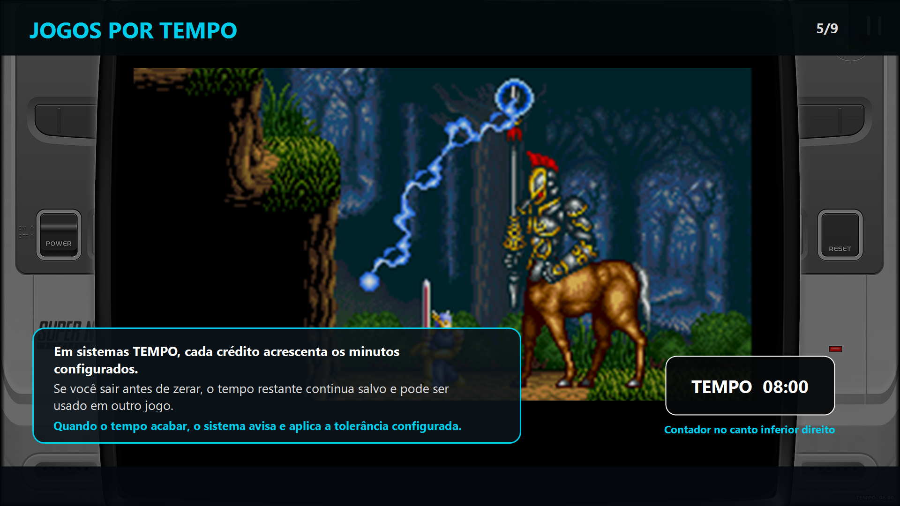
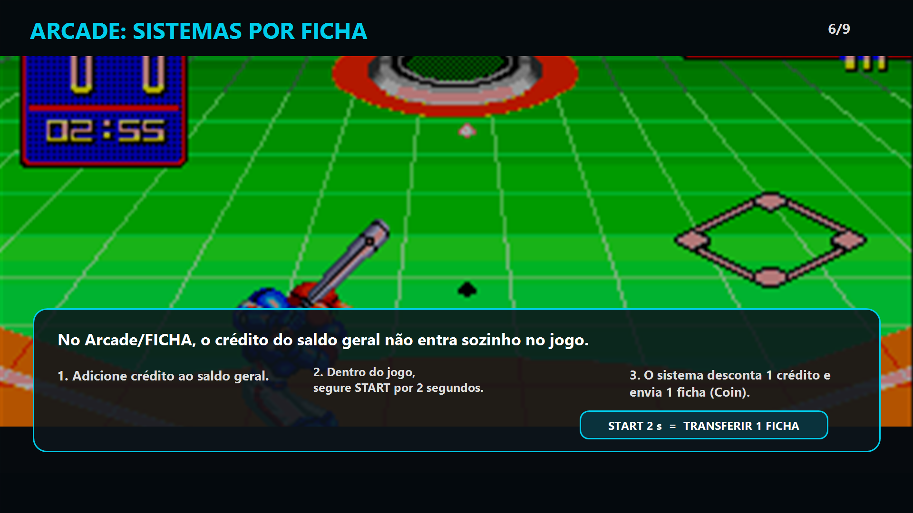
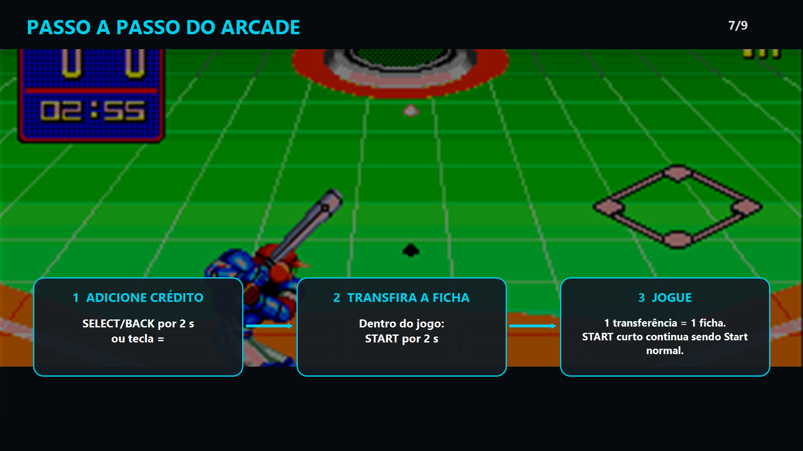
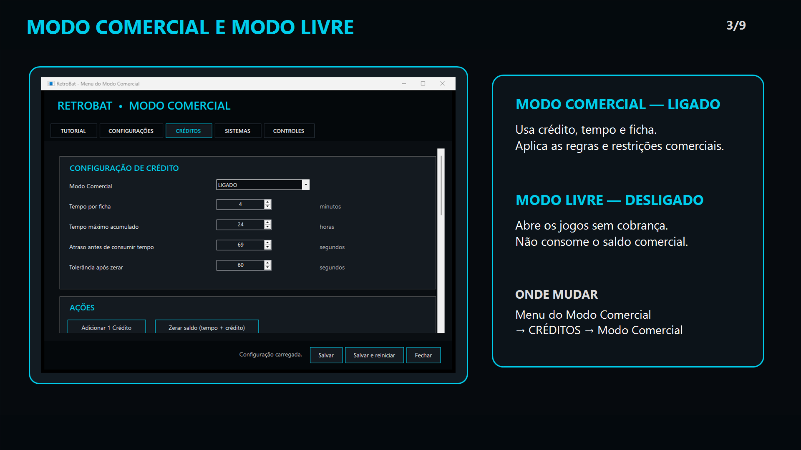
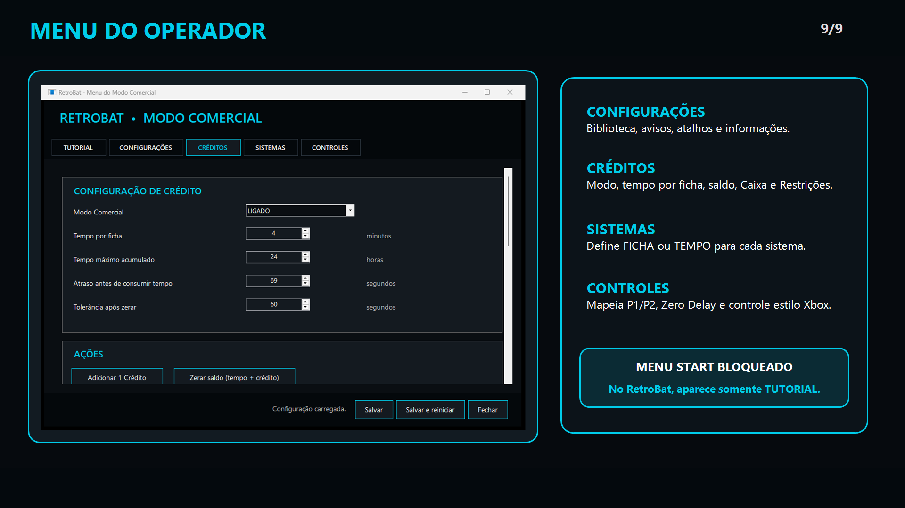
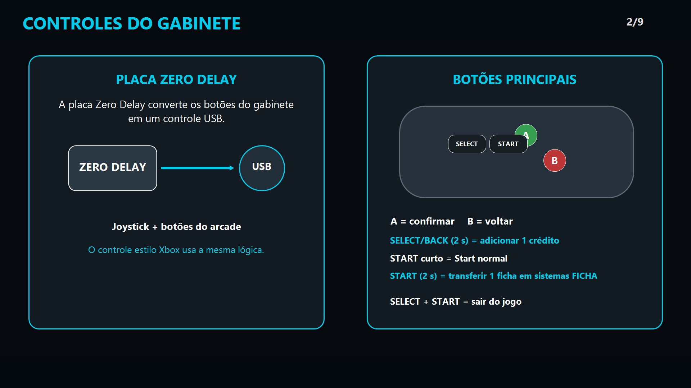
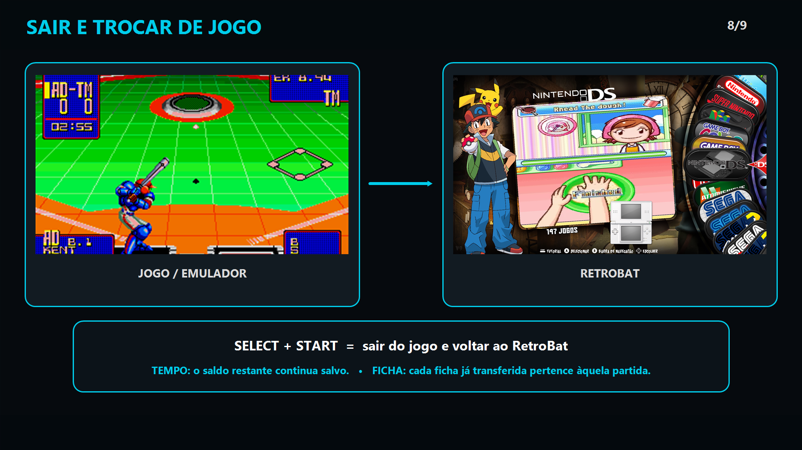

# RetroBat Modo Comercial v1.0

  <strong>Sistema comercial para RetroBat com modos por TEMPO e FICHA, Modo Livre, contador integrado, painel administrativo e tutorial nativo.</strong>

> **Não inclui ROMs nem BIOS.**

> [!IMPORTANT]
> **PROJETO GRATUITO — NÃO ESTÁ À VENDA.**
> Se você pagou por uma cópia deste projeto, solicite reembolso ao vendedor.
> Repositório oficial: **https://github.com/MagraoXX/Retrobat-Modo-Comercial**
> Criado por **Magrão XX / China Peleleca**.

## Sobre o projeto

O **RetroBat Modo Comercial** adiciona uma camada de operação comercial ao RetroBat sem transformar o projeto em um frontend separado.

O operador pode configurar créditos, tempo, sistemas por ficha, restrições e controles, enquanto o jogador continua usando uma interface baseada no RetroBat/EmulationStation.

A versão final possui dois modos de funcionamento:

- **Modo Comercial** — utiliza créditos, tempo e ficha.
- **Modo Livre** — desativa a cobrança comercial e libera o uso normal dos jogos.

---

## Modo Comercial

### Sistemas por TEMPO

Nos sistemas configurados como **TEMPO**, cada crédito acrescenta minutos ao saldo geral.

Configuração padrão desta versão:

- **1 crédito = 10 minutos**
- **Atraso antes do consumo = 60 segundos**
- **Tolerância após o tempo zerar = 60 segundos**

O saldo não pertence a um único jogo. Se o jogador sair antes de o tempo terminar, o restante continua disponível em outro jogo configurado como TEMPO.

### Sistemas por FICHA

Nos sistemas configurados como **FICHA**, o crédito geral não entra automaticamente no jogo.

Fluxo:

1. adicionar crédito ao saldo geral;
2. abrir o jogo;
3. segurar **START por 2 segundos**;
4. o sistema consome 1 crédito geral;
5. 1 ficha é enviada ao jogo.

---

## Modo Livre

O operador pode alternar o sistema para **Modo Livre**.

Nesse modo:

- não há cobrança por tempo;
- não há bloqueio por falta de crédito;
- os jogos podem ser iniciados normalmente;
- os menus ficam liberados;
- sons e avisos comerciais deixam de interferir na utilização normal.

---

## Sistema de créditos

### Adicionar crédito

No controle:

**SELECT / BACK pressionado por 2 segundos**

No teclado:

**=**

Cada acionamento adiciona **1 crédito ao saldo geral**.

### Transferir ficha no Arcade

Nos sistemas configurados como **FICHA**:

**START pressionado por 2 segundos → transfere 1 ficha**

O toque curto continua funcionando como Start normal.

---

## Contador integrado

O Modo Comercial utiliza o mesmo saldo no menu e nos jogos.

Nos sistemas por TEMPO, o contador é atualizado em tempo real e aparece durante a partida no **canto inferior direito**.

Exemplo:

`10:00 → 09:59 → 09:58`

Ao sair de um jogo, o saldo restante permanece salvo.

O contador também possui supervisão automática: se o processo visual for encerrado, o Controller Bridge o inicia novamente.

---

## Menu do operador

O painel administrativo é aberto por:

`Retrobat menu comercial.exe`

Ele é organizado em cinco áreas:

- **TUTORIAL**
- **CONFIGURAÇÕES**
- **CRÉDITOS**
- **SISTEMAS**
- **CONTROLES**

### Créditos

A área **CRÉDITOS** contém:

- Modo Comercial / Modo Livre;
- tempo por ficha;
- tempo máximo acumulado;
- atraso antes de consumir;
- tolerância após zerar;
- Caixa;
- Restrições.

### Caixa

O Caixa registra:

- créditos inseridos;
- créditos consumidos;
- tempo vendido;
- partidas iniciadas.

Ações disponíveis:

- **Atualizar**
- **Zerar estatísticas**
- **Zerar tempo e crédito**

A ação administrativa **Adicionar 1 crédito** não faz parte da versão final.

### Restrições

Podem ser configuradas restrições para:

- Menu Start;
- Acesso Rápido;
- Opções de Jogo;
- Alt + Tab;
- Alt + F4.

Quando o **Menu Start** está bloqueado, o acesso pelo RetroBat mostra somente o **Tutorial**.

---

## Sistemas

A aba **SISTEMAS** permite definir individualmente se cada sistema funciona como:

- **TEMPO**
- **FICHA**

Isso permite adaptar a instalação ao tipo de plataforma ou gabinete utilizado.

---

## Controles

O projeto foi preparado para gabinetes com placa **Zero Delay** e também para controles no padrão Xbox.

| Comando | Função |
|---|---|
| SELECT / BACK — 2 s | Adicionar 1 crédito |
| START — toque curto | Start normal |
| START — 2 s | Transferir 1 ficha em sistemas FICHA |
| SELECT + START | Sair do jogo |
| Direcional | Navegação |
| A | Confirmar |
| B | Voltar |

A mesma lógica pode ser utilizada pelo **Player 1** e pelo **Player 2**, conforme o mapeamento configurado.

---

## Tutorial integrado

O tutorial funciona **dentro do próprio RetroBat/EmulationStation**.

Ele possui 9 páginas:

1. Bem-vindo ao Modo Comercial
2. Controles do gabinete
3. Modo Comercial e Modo Livre
4. Como adicionar crédito
5. Jogos por tempo
6. Arcade por ficha
7. Passo a passo do Arcade
8. Sair e trocar de jogo
9. Menu do operador

Controles do tutorial:

- **← / →** — trocar página
- **A** — avançar
- **B** — fechar imediatamente o tutorial

---

## Avisos e voz

O sistema possui suporte a avisos relacionados ao tempo restante.

Podem ser ativados ou desativados:

- aviso de 1 minuto;
- aviso de 30 segundos;
- voz do sistema;
- sons do sistema.

---

## Pacote portátil

A pasta principal da distribuição é:

`Retrobat modo comercial`

Na raiz existem somente dois executáveis de entrada:

- **`Retrobat modo comercial.exe`** — inicia o ambiente comercial.
- **`Retrobat menu comercial.exe`** — abre o painel administrativo.

O sistema resolve automaticamente os caminhos internos da instalação.

Também existe suporte a diretórios com espaços no nome por meio de um caminho temporário interno durante a execução.

---

## Biblioteca

**ROMs e BIOS não fazem parte do pacote.**

No primeiro uso, o launcher tenta localizar uma biblioteca válida na própria unidade. Caso não encontre, o operador pode selecionar a localização da biblioteca.

Isso permite manter ROMs e BIOS separadas da distribuição.

---

## Configuração padrão da v1.0

| Configuração | Valor |
|---|---:|
| Tempo por crédito | **10 minutos** |
| Atraso inicial do consumo | **60 segundos** |
| Tolerância após zerar | **60 segundos** |
| Saldo inicial | **0** |
| Estatísticas iniciais | **0** |

---

## Download

Consulte [Download e verificação do pacote](DOWNLOAD.md). O ZIP atualizado tem aproximadamente **6,6 GB**; o link público ainda será adicionado.

## Aviso

Este é um projeto independente e não possui afiliação oficial com o RetroBat.

RetroBat, emuladores, consoles, jogos e marcas citadas pertencem aos seus respectivos projetos e proprietários.

**Nenhuma ROM ou BIOS é distribuída com este projeto.**

## Atualização de 1º de outubro de 2026

- Correção do contador para ficar oculto no Modo Livre.
- No Modo Livre, Select envia ficha diretamente ao arcade sem consumir saldo geral e sem exigir pressionamento longo.
- Pasta `mp3` disponível para músicas adicionais do menu.
- Pacote atualizado: consulte [Download](DOWNLOAD.md). O link público ainda será adicionado.